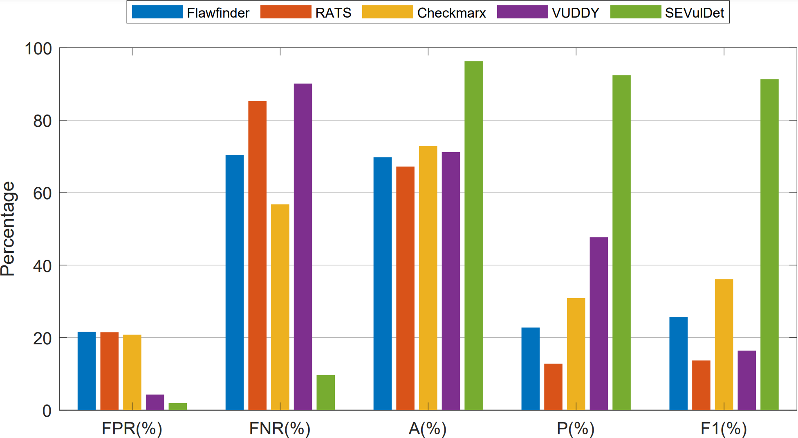
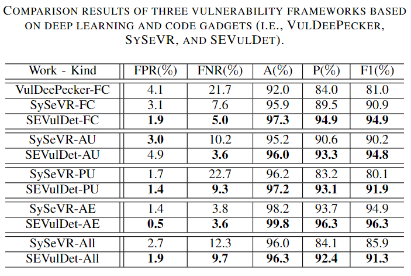
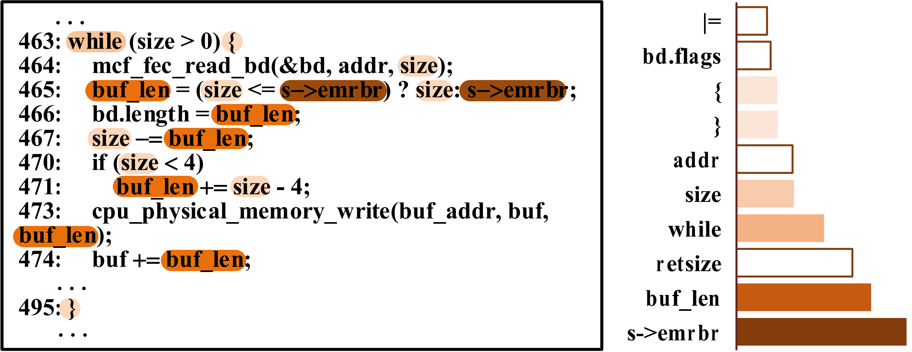

# SEVulDet #
SEVulDet is a semantics-enhanced deep learning-based framework that can accurately pinpoint vulnerability patterns by extracting, preserving, and learning more semantics.

*E-mail* for communication: zqtang@hnu.edu.cn

## Details of SEVulDet

Recent years have seen increased attention to deep learning-based vulnerability detection frameworks that leverage neural networks to identify vulnerability patterns. Considerable efforts have been made; still, existing approaches are less accurate in practice. Prior works fail to comprehensively capture semantics from source code or adopt the appropriate design of neural networks.

This paper presents SEVulDet, a semantics-enhanced deep learning-based framework that can accurately pinpoint vulnerability patterns by extracting, preserving, and learning more semantics. Firstly, SEVulDet employs a path-sensitive code slicing approach to extract sufficient path semantics into code gadgets. Secondly, based on a convolutional neural network with a spatial pyramid pooling layer, SEVulDet can preserve semantics lost by discarding or padding operations when dealing with flexible length codes. Finally, we adopt the multilayer attention mechanism to enhance semantics learning. Experimental results show that SEVulDet vastly outperforms classical static approaches and excels with state-of-the-art deep learning-based solutions, with an average F1-score of up to 94.5%. Notably, the elaborate design of the SEVulDet architecture helped us identify a vulnerability that was not reported by existing techniques.

## Experiment Result

we compare SEVULDET with the open-source analysis tool Flawfinder, the Rough Auditing Tool for Security (RATS), the commercial detection tool Checkmarx, and the similarity-based framework VUDDY. We observe that our framework SEVULDET vastly outperforms the state-of-the-art classical static vulnerability detection methods.

----

SEVULDET excels with state-of-the-art deep learning-based solutions, with an average F1-score of up to 94.5%. 

----

We feed CVE-2016-9776 code gadget into pretrained SEVulDet and visualize the ten tokens of most interest to the attention mechanism. Multiple of these tokens appear on lines 463, 465, 466, and 467, which are the locations where the vulnerability was formed.

